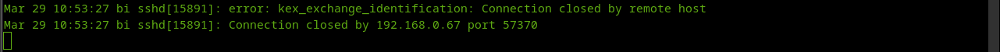

# Домашнее задание к занятию "`Защита сети`" - `Шафиков Ринат`

---

### Задание 1

Проведите разведку системы и определите, какие сетевые службы запущены на защищаемой системе:

sudo nmap -sA < ip-адрес >

sudo nmap -sT < ip-адрес >

sudo nmap -sS < ip-адрес >

sudo nmap -sV < ip-адрес >

По желанию можете поэкспериментировать с опциями: https://nmap.org/man/ru/man-briefoptions.html.

В качестве ответа пришлите события, которые попали в логи Suricata и Fail2Ban, прокомментируйте результат.

### Решение 1

ip_kali 192.168.0.67
ip_host 192.168.0.9 eth0

/var/lib/suricata/rules/suricata.rules

```
sudo apt update && sudo apt upgrade -y
sudo apt install fail2ban
sudo systemctl start fail2ban
sudo systemctl enable fail2ban
sudo systemctl status fail2ban
sudo apt install software-properties-common
sudo add-apt-repository ppa:oisf/suricata-stable
sudo apt install suricata
sudo suricata-update
sudo systemctl status suricata
ip a
sudo nano /etc/suricata/suricata.yaml
sudo systemctl restart suricata
```
```
sudo nmap -sA 192.168.0.9
```

Сообщений в логах нет (nmap не смог определить операционную систему)

```
sudo nmap -sT 192.168.0.9
```


```
sudo nmap -sS 192.168.0.9
```


```
sudo nmap -sV 192.168.0.9
```

suricata:


fail2ban:




---

### Задание 2

`Приведите ответ в свободной форме........`

Проведите атаку на подбор пароля для службы SSH:

hydra -L users.txt -P pass.txt < ip-адрес > ssh

1. Настройка hydra:
   - создайте два файла: users.txt и pass.txt;
   - в каждой строчке первого файла должны быть имена пользователей, второго — пароли. В нашем случае это могут быть случайные строки, но ради эксперимента можете добавить имя и пароль существующего пользователя.
Дополнительная информация по hydra: https://kali.tools/?p=1847.

2. Включение защиты SSH для Fail2Ban:
   - открыть файл /etc/fail2ban/jail.conf,
   - найти секцию ssh,
   - установить enabled в true.
Дополнительная информация по Fail2Ban:https://putty.org.ru/articles/fail2ban-ssh.html.

В качестве ответа пришлите события, которые попали в логи Suricata и Fail2Ban, прокомментируйте результат.

### Решение 2

```
Поле для вставки кода...
....
....
....
....
```

`При необходимости прикрепитe сюда скриншоты
`


---
